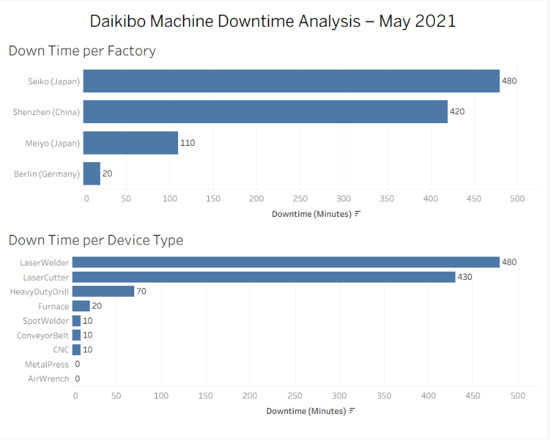

# 📊 Deloitte Tableau Machine Downtime Analysis

An interactive Tableau dashboard developed as part of the **Deloitte Data Analytics Virtual Internship**. This project analyzes machine telemetry data from multiple manufacturing factories to identify downtime patterns and support operational decision-making.

---

## 📌 Project Overview

Daikibo, a manufacturing company, collected telemetry data from machines across four factories during **May 2021**. The objective was to analyze machine downtime and answer key business questions using Tableau.

---

## 🎯 Business Questions

- Which factory experienced the highest machine downtime?
- Which machine types contributed the most downtime in that factory?

---

## 🛠️ Tools & Technologies

- Tableau
- JSON
- Data Visualization
- Interactive Dashboard
- Calculated Fields

---

## 📈 Dashboard Features

- Interactive **Down Time per Factory** analysis
- Dynamic **Down Time per Device Type** visualization
- Dashboard filter actions
- Business-friendly dashboard design
- Automated downtime calculation using a calculated field

---

## 📊 Key Insights

- **Factory with Highest Downtime:** Seiko (Japan)
- **Highest Downtime Device:** LaserWelder
- Dashboard enables interactive analysis by selecting any factory to view its corresponding device downtime.

---

## 🖼️ Dashboard Preview


```

---

## 📂 Repository Structure

```
deloitte-tableau-machine-downtime-analysis/
│
├── README.md
├── LICENSE
└── TASK_1.png
└── TASK-1.png
```

---

## 📚 Skills Demonstrated

- Data Analysis
- Business Intelligence
- Tableau Dashboard Development
- Interactive Data Visualization
- JSON Data Handling
- Calculated Fields
- Manufacturing Analytics
- Business Problem Solving

---

## ⚠️ Dataset Notice

The dataset used in this project was provided as part of the **Deloitte Data Analytics Virtual Internship**.

To respect the original content and licensing of the internship materials, the dataset is **not included** in this repository. This repository shares only the dashboard, analysis, and project documentation for educational and portfolio purposes.

---

## 🚀 Learning Outcomes

Through this project, I gained practical experience in:

- Importing and analyzing JSON datasets in Tableau
- Creating calculated fields for business metrics
- Building interactive dashboards
- Applying dashboard actions and filters
- Translating business requirements into actionable insights

---

## 👨‍💻 Author

**Sumit Kumar**

- GitHub: https://github.com/1998sumitkumar67-arch
- LinkedIn: https://www.linkedin.com/in/sumit-kumar-35b55437a
